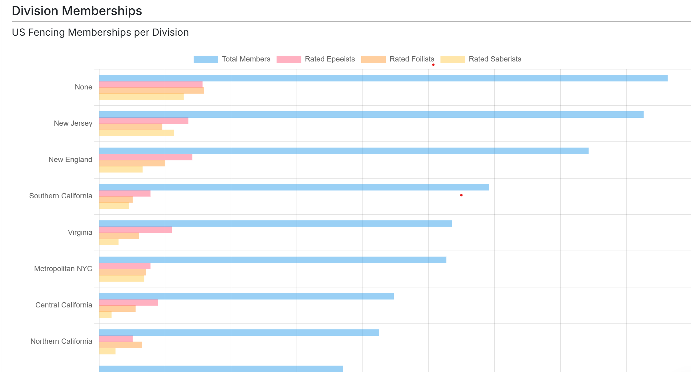

| [home page](https://cmustudent.github.io/tswd-portfolio-templates/) | [data viz examples](dataviz-examples) | [critique by design](critique-by-design) | [fencing visualization](fencing-visualization) | [final project I](final-project-part-one) | [final project II](final-project-part-two) | [final project III](final-project-part-three) |

# US Fencing Divisions Interactive Visualization

## Executive Summary

For this project, I selected a data visualization showing membership and rated-fencer distributions across USA Fencing divisions. I chose it because the information is highly relevant to the fencing community yet the original design made certain comparisons—especially between weapon types—difficult to interpret. My goal was to create a visualization that maintained the usefulness of the original ranking while offering a clearer, more intuitive way to explore the data. The original visualization can be found here: https://www.askfred.net/data/usfa and the dataset includes total division membership along with counts of rated foilists, epeeists, and saberists.

Based on these observations, I sketched wireframes mapping out a new interactive experience. Instead of a static bar chart, I envisioned a map-based bubble interface where users could toggle between metrics (total members, foilists, epeeists, saberists), click on regions for detailed breakdowns, and view quick insights such as a dynamic Top 5 list. I used React Leaflet to build the visualization—supported by CMU-approved ChatGPT assistance—because unlike Tableau or Datawrapper, it allowed me to fully realize my creative ideas without platform constraints.

The final product is an interactive React-based map that allows users to explore the same data in a more intuitive, customizable, and visually balanced way. By shifting from a bar chart to a map, separating metrics, and applying user feedback, the redesign demonstrates how the same dataset can be communicated in a more engaging and insightful format.

## Original Visualization

*The original bar chart visualization showing US Fencing division membership and rated fencer counts.*

The original visualization can be found here: [USA Fencing Divisions Data](https://www.askfred.net/data/usfa)

## Critique

My process began with a detailed critique of the existing bar chart. Using a structured evaluation approach, I identified that the vertical ranking worked well for showing which divisions were largest, but the long "total member" bars visually overpowered the smaller rated-fencer bars. This made it hard to understand the distribution of weapons across regions. I also noticed that the visualization forced users to scroll through many bars, which slowed comparisons and made the graph feel heavy despite its simplicity. These insights guided my decision to redesign the visualization around clarity, metric separation, and spatial context.

The original bar chart ranked divisions well, but the very large "total members" bars overshadowed the smaller rated-fencer bars, making weapon-level comparisons difficult. By separating metrics and letting the user highlight one at a time, the new design makes those comparisons distinct and easier to interpret. Because the target audience is USA Fencing members using AskFRED, the map format also aligns better with how they think about divisions geographically.

## Wireframes

My wireframes show a redesign that transforms the original ranked bar chart into an interactive, map-based visualization of US fencing divisions. Instead of scrolling through long bars, users now see each division as a bubble placed on a US map. Bubble size changes based on the selected metric—total members, rated foilists, epeeists, saberists, or most-popular weapon—making comparisons clearer and more intuitive. A search bar, metric toggle, and clickable bubbles allow users to explore specific regions, while a side panel presents detailed breakdowns without overwhelming the main view. An export button provides the same data as a downloadable CSV.

This redesign directly addresses the issues identified in my critique. Overall, the wireframes clearly communicate a tool that helps users quickly understand where fencers are concentrated and how different regions differ by weapon type.

## Critiques from Three Individuals

I shared my wireframes with three individuals and received helpful feedback that directly shaped my redesigned visualization.

**CMU Design Alum:** Suggested adding a toggle that allows users to switch between overlapping and non-overlapping bubbles. I incorporated this by including a "Bubble View Mode" control, giving users the flexibility to compare divisions either clearly separated or stacked for density comparison.

**MISM BIDA Student:** Recommended adding a "Top 5" section so users don't have to interpret every division at once, unlike the original chart. I integrated this below the map as a dynamic list that updates based on the selected metric, helping users quickly see which divisions lead in members or specific weapons.

**CMU Undergraduate:** Emphasized the importance of using distinct colors for foil, epee, and saber to avoid visual confusion. I applied this by assigning each weapon its own clearly differentiated color throughout the legend, metric toggle, and side-panel breakdown.

Overall, these recommendations improved clarity, usability, and user control, and they are now fully reflected in the updated wireframes.

## New Visualization

  <iframe 
    src="visualization-build/index.html" 
    width="100%" 
    height="100%"
    frameborder="0"
    style="border: none;"
    title="US Fencing Divisions Interactive Map"
  ></iframe>

*Interactive map visualization showing US Fencing divisions with bubble markers. Toggle between different metrics (total members, foilists, epeeists, saberists) and click on divisions for detailed breakdowns.*

[View full screen →](visualization-build/index.html)

## References

- Original visualization: [USA Fencing Divisions Data](https://www.askfred.net/data/usfa)
- React Leaflet documentation: [https://react-leaflet.js.org/](https://react-leaflet.js.org/)
- Leaflet mapping library: [https://leafletjs.com/](https://leafletjs.com/)

## AI Acknowledgements

I used ChatGPT (CMU-approved) to assist with this project in the following ways:

- **Write-up improvement:** ChatGPT helped refine and improve the clarity and structure of the written summary and critique sections, ensuring the narrative was clear and well-organized.

- **Coding assistance:** ChatGPT provided guidance and code examples for implementing the React Leaflet map visualization, including help with component structure, state management, and styling with Tailwind CSS.

All code and design decisions were ultimately made by me, with ChatGPT serving as a collaborative tool to help realize the visualization concept.
